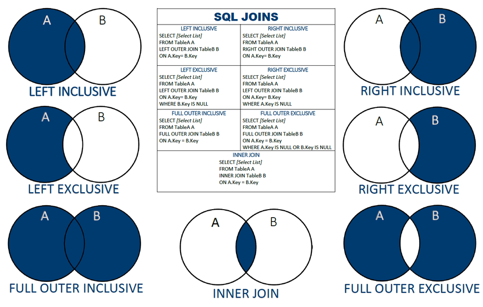

# SQL за 120 минут  

## Настройка рабочей среды

**Jetbrains Datagrip**
Скачать через Toolbox  
Доступен бесплатно по универской почте  
https://www.jetbrains.com/toolbox-app/  
  
**GCP SDK**
gcloud  
https://cloud.google.com/sdk/docs/install  
gcloud init  
  
**GCP x Datagrip = nice**
Включить доступы  
https://cloud.google.com/console/apis/library/sql-component.googleapis.com  
Загрузить драйверы  
https://github.com/GoogleCloudPlatform/cloud-sql-jdbc-socket-factory/blob/master/ 
README.md  
https://github.com/GoogleCloudPlatform/cloud-sql-jdbc-socket-factory/releases  
  
Пример строки соединения  
jdbc:postgresql:///postgres?cloudSqlInstance=nimble-sylph-666:us-central1:pg-dsis-instance1&socketFactory=com.google.cloud.sql.postgres.SocketFactory
  
**Прогрузка данных**
https://cloud.google.com/storage/docs/creating-buckets  
Создадим бакет и загрузим в него следующие файлы:  
* https://storage.googleapis.com/dsis-data/appdev.dump    
* https://storage.googleapis.com/dsis-data/exclude-extensions.list  
Настройки бакета - finegrained access   

Импорт дампа в созданный инстанс PostgreSQL   
* создать юзера appdev, базу appdev
* авторизация ip-адреса Cloud Shell: 
`gcloud sql connect pg-dsis-instance1--user=postgres --quiet`

**Создадим базу данных**
Сделаем импорт в созданную базу:
* cloud shell connect to pg-instance
* gsutil cp gs://dsis-data/appdev.dump appdev.dump
* копируем аналогично exclude-extensions.list
* воссоздание базы
```sql
create user appdev with createdb createrole;
ALTER USER appdev WITH PASSWORD 'appdev';
grant appdev to postgres;
create database appdev with owner appdev;
```
```bash
pg_restore -h 34.70.8.134 -p 5432 -U appdev -d appdev --use-list=exclude-extensions.list appdev.dump
```


## Модели данных 

С чем привыкли работать:  
* native-переменные
* контейнеры (кортежи, списки, словари)
* собственные объекты (композиция?! агрегация?!)

Данные нужно как-то хранить    
```python
class User:
	uid: str = "1"
	name: str = "Nikolay"
	accounts: list[account] = [Account("deposit1"), Account("debitcard1"), Account("creditcard1")]
```

**Полуструктурированность** - yaml, toml, hocon, ....  

```json
{
	"uid": "1",
	"name": "Nikolay",
    "accounts": [
    	{"depo_id": "deposit1"},
        {"depo_id": "debitcard1"},
    	{"depo_id": "creditcard1"}
    ]
}
```

**Неструктурированность** - csv, excel
Можно ли User сохранить в такой вид?


**Структурированность** - реляционная модель  
Каждая сущность моделируется при помощи таблицы.  
Таблица состоит из двух компонентов:  
* описание - содержится в каталоге СУБД
  Таблица состоит из полей, каждое поле имеет свой порядок, имя и тип данных  
* данные, хранящиеся в виде списка упорядоченных кортежей
  
Пример из postgres:  
```
demo=# select * from bookings.aircrafts_data limit 5;
 aircraft_code |                                  model                              | range 
---------------+---------------------------------------------------------------------+-------
 773           | {"en": "Boeing 777-300", "ru": "Боинг 777-300"}                     | 11100
 763           | {"en": "Boeing 767-300", "ru": "Боинг 767-300"}                     |  7900
 SU9           | {"en": "Sukhoi Superjet-100", "ru": "Сухой Суперджет-100"}          |  3000
 320           | {"en": "Airbus A320-200", "ru": "Аэробус A320-200"}                 |  5700
 321           | {"en": "Airbus A321-200", "ru": "Аэробус A321-200"}                 |  5600
(5 rows)

demo=# \d bookings.aircrafts_data
     Table "bookings.aircrafts_data"
    Column     |     Type     | Modifiers 
---------------+--------------+-----------
 aircraft_code | character(3) | not null
 model         | jsonb        | not null
 range         | integer      | not null
```


Ее превосходство:  
* легкое моделирование композиций/агрегаций
  one-to-many, many-to-many
  `user(uid,name) --> account(depo_id, uid)`
* статичная типизация хранения  
* обеспечиваемая консистентность данных
  * логические ограничения (enum, predicate, unique)
  * ограничения связей (foreign key)
  

## SQL
Чтобы получить результат, нужно описать его в виде запроса  
Пример SQL2003 + style guide: 

```sql
select
      t.passenger_name
     ,t.passenger_id
     --,t.xyz_field
from bookings.tickets t
    join bookings.ticket_flights tf on t.ticket_no = tf.ticket_no
        join bookings.flights_v f on f.flight_id = tf.flight_id
where f.scheduled_departure::date > '2010-09-14'
group by t.passenger_id, t.passenger_name
having count(distinct f.departure_airport) > 4
order by t.passenger_name
limit 10;
```
 
Вариация (старые версии sql): 
```sql
select
      t.passenger_name
     ,t.passenger_id
from bookings.tickets t,
     bookings.ticket_flights tf,
     bookings.flights_v f 
where f.scheduled_departure::date > '2010-09-14'
      and t.ticket_no = tf.ticket_no
      and f.flight_id = tf.flight_id
group by t.passenger_id, t.passenger_name
having count(distinct f.departure_airport) > 4
order by t.passenger_name
limit 10;
```
  
Структура SQL-запроса:  
* Список таблиц - все аргументы после from и join.  
  Информация вытягиваются из каталога таблиц
* Дерево условий - КНФ предикат, все что указано в WHERE
* Список проекций - все поля из select  

**Этапы выполнения запроса**  
Мы определяем формирование выборки, формирует ее автосгенерированный СУБД код  
Этапы обработки:  
* Проверка синтаксиса => синтаксическое дерево
* Логическая проверка атрибутов/условий - все ли таблицы существуют, всех ли полей достаточно => логический план запроса
  * Преобразование логического правила совокупностью правил (rule-based)
* Cost-based оптимизация - выбор наилучшего варианта выполнения.
  ?! список таблиц - N элементов (N-1 джоин), сколько способов сделать выборку?
  Выбор наилучшего варианта  
* Генерация кода по каждому элементу физического плана запроса, исполнение драйвером, отдача клиенту результата (СУБД - клиент-серверная архитектура)  


Этот процесс дает нам понимание, когда ключевое слово синтаксиса начинает работать:  
* from, join - всегда начинаем с чего нужно выбирать  
* where, join predicates - как это нужно фильтровать 
* select - что должно быть в итоговой выборке
* order by - сортировка результата
* limit - ограничение объемов результата  

SQL стремится быть похожим на естественный язык, поэтому существует синтаксический порядок:  
* select
* from, join
* where
* group by, having
* order by
* limit


**Типы операций в SQL**
Выше мы рассмотрели select. SQL предоставляет полный цикл манипуляции данными/объектами:  
* create - что-то создать (таблицу, схему таблиц, ограничение)
* alter - изменить атрибуты существующего объекта
* drop - удалить объект
* grant/revoke - представить/лишить учетную запись прав на объект
* select 
* update  
* delete
* insert - вставить строки (явно перечисленные или получаемые в результате select) 

Принцип работы update/delete не отличается от select - выбранные строки из желаемой таблицы обновляются/удаляются.  

**Join**  
## Соединения (джойны)

Даны две таблицы - t1, t2.   
Их множества колонок - с1, c2.
Придумаем предикат - t1.col1 = t2.col2.  

Можно объединять таблицы при выборке данных на основе предиката.  
Глядя на диаграмму важно помнить - результирующее множество состоит из колонок c1 + c2.

* INNER JOIN - только записи по предикату.
* LEFT (OUTER) JOIN:
    * записи из t1, не удовлетворявшие предикату -> r1. 
      r1.c1 заполнено из значениями из t1, r1.c2 заполнено нулями
    * записи из t1 удовлетворившие предикату -> r2
      r2.c1 заполнено из значениями из t1, r1.c2 заполнено значениями из t2
* RIGHT (OUTER) JOIN - отражение
    * записи из t2, не удовлетворявшие предикату -> r1. 
      r1.c2 заполнено из значениями из t2, r1.c1 заполнено нулями
    * записи из t2 удовлетворившие предикату -> r2
      r2.c2 заполнено из значениями из t2, r1.c1 заполнено значениями из t1
* FULL (OUTER) JOIN - объединение по предикату.
    * записи из t1, не удовлетворявшие предикату -> r1. 
      r1.c1 заполнено из значениями из t1, r1.c2 заполнено нулями
    * записи из t1 удовлетворившие предикату -> r2
      r2.c1 заполнено из значениями из t1, r1.c2 заполнено значениями из t2
    * записи из t2, не удовлетворявшие предикату -> r3. 
      r3.c1 заполнено нулями, r1.c2 заполнено значениями из t2
* CROSS JOIN - декартово произведение

**Note 1** - несколько джойнов всегда сводятся к "джойну двух таблиц"  
Outer/inner таблицы - inner-таблица активно опрашивается при обработке. 
Результат предыдущего джойна выступает в виде outer-таблицы на следующего  
  

**Note 2** - быстрота джойна зависит от выбранного варианта исполнения:  
* nested loop join
* sort merge join
* hash join
Подробней 


**Where предикаты**  
Список операторов  
Скалярные/векторные предикаты   
